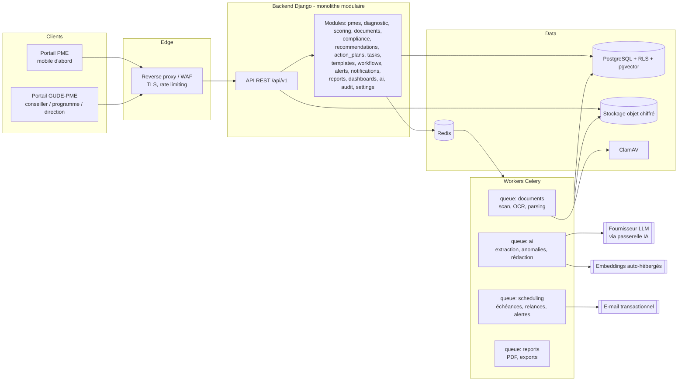

# Document 2 — Architecture technique

## 1. Style d'architecture : monolithe modulaire

**Décision (ADR-001)** : démarrer avec un **monolithe modulaire** (un backend, des modules aux frontières explicites) accompagné de **workers asynchrones** séparés, et non avec des microservices.

| Critère | Monolithe modulaire | Microservices |
|---|---|---|
| Équipe de départ (2 à 6 développeurs) | ✅ adapté | ❌ surcoût d'exploitation |
| Transactions multi-modules (score ↔ document ↔ action) | ✅ transactions SQL simples | ❌ sagas et cohérence éventuelle |
| Évolutivité jusqu'à ~10 000 PME | ✅ largement suffisant | inutile à ce stade |
| Extraction future d'un module (par ex. IA) | ✅ possible si les frontières sont respectées | natif |

Règles de frontière : chaque module expose un **service applicatif** (`services.py`) et des **événements de domaine**. Aucun module n'importe les modèles internes d'un autre module (règle vérifiée par `import-linter` en CI).

## 2. Stack technique retenue (à valider, cf. ADR-002)

| Couche | Choix | Pourquoi |
|---|---|---|
| Backend | **Python 3.12 + Django 5 + Django REST Framework** | ORM et migrations robustes, auth, admin interne, écosystème Python natif pour l'IA, l'OCR, la finance et les PDF |
| Schéma API | **drf-spectacular** (OpenAPI 3) | Contrat d'API généré, client TypeScript généré automatiquement |
| Tâches asynchrones | **Celery + Redis** ; **Celery Beat** pour les planifications | Pipeline documentaire, génération des échéances, relances, rapports |
| Base de données | **PostgreSQL 16** + **pgvector** + **Row-Level Security** | Relationnel robuste, JSONB pour la configuration, vecteurs pour le RAG, isolation des tenants |
| Stockage de fichiers | **Stockage objet compatible S3** (MinIO auto-hébergé ou cloud) | Chiffrement côté serveur, URL signées à durée courte, versionnement |
| Antivirus | **ClamAV** (démon `clamd`) | Scan systématique avant toute autre étape |
| OCR | **OCRmyPDF / Tesseract (fra)**, puis vision LLM en repli | Local, gratuit, préserve la confidentialité ; la vision LLM ne sert qu'aux scans difficiles |
| Parsing | pdfplumber, python-docx, openpyxl, Pillow | Formats PDF, Word, Excel et images |
| LLM | **Claude (Anthropic)** via une passerelle IA interne abstraite | Qualité d'extraction structurée et de rédaction en français ; abstraction pour pouvoir changer de fournisseur |
| Embeddings | Modèle multilingue **auto-hébergé** (par ex. `bge-m3`) | Les documents ne quittent pas l'infrastructure pour la vectorisation |
| Moteur de règles | **JSON Logic** stocké en base + éditeur visuel | Règles modifiables sans code, évaluables côté serveur et côté client |
| Rapports PDF | **WeasyPrint** (HTML/CSS → PDF) | Gabarits HTML versionnés, rendu professionnel, graphiques SVG |
| Frontend | **Next.js (React, TypeScript)**, Tailwind CSS, shadcn/ui | Composants accessibles, responsive, productivité |
| Données côté client | TanStack Query, react-hook-form + zod | Cache, formulaires robustes, validation partagée |
| Graphiques | Apache ECharts (ou Recharts) | Jauges, radars, séries temporelles, heatmaps |
| Observabilité | structlog (logs JSON), OpenTelemetry, Prometheus + Grafana, Sentry (ou GlitchTip auto-hébergé) | Traçabilité technique, alertes d'exploitation |
| Tests | pytest, factory_boy, pytest-django ; Vitest + Testing Library ; **Playwright** (E2E) | Tests unitaires, d'intégration et de bout en bout |
| Conteneurs | Docker, Docker Compose (dev / recette), orchestrateur en production selon l'hébergement | Portabilité entre hébergement local et cloud |
| CI/CD | GitHub Actions ou GitLab CI | Lint, typage, tests, scan de dépendances, build d'images |

> **Alternative étudiée** : NestJS (TypeScript) de bout en bout. Elle a été écartée pour le MVP parce que l'essentiel de la valeur différenciante (OCR, extraction, calculs financiers, RAG, PDF) se trouve dans l'écosystème Python. Le frontend reste en TypeScript.

## 3. Vue d'ensemble



## 4. Organisation du dépôt

```
pme360/
├── backend/
│   ├── config/                 # settings (base/dev/test/prod), urls, celery, asgi/wsgi
│   ├── pme360/
│   │   ├── core/               # tenancy, RLS, permissions, base models, events, erreurs
│   │   ├── accounts/           # Authentication + Users + rôles
│   │   ├── organizations/      # tenants, programmes, cohortes
│   │   ├── pmes/
│   │   ├── diagnostic/         # référentiel versionné + sessions + réponses
│   │   ├── scoring/            # moteur de calcul, snapshots, explications
│   │   ├── documents/          # stockage, versions, pipeline
│   │   ├── compliance/         # obligations, échéances, registre réglementaire
│   │   ├── recommendations/    # moteur de règles, catalogue d'offres
│   │   ├── action_plans/       # plans, jalons, roadmap
│   │   ├── tasks/              # actions, dépendances, commentaires
│   │   ├── templates_lib/      # bibliothèque de livrables
│   │   ├── workflows/          # machines à états configurables
│   │   ├── alerts/
│   │   ├── notifications/
│   │   ├── ai/                 # passerelle, prompts versionnés, extracteurs, RAG, copilot
│   │   ├── reports/
│   │   ├── dashboards/         # requêtes analytiques, vues matérialisées
│   │   ├── audit/
│   │   └── settings_app/
│   ├── seeds/                  # référentiel par défaut + PME fictives de démonstration
│   └── tests/
├── frontend/
│   ├── app/(pme)/              # portail PME
│   ├── app/(gude)/             # portail GUDE-PME
│   ├── components/ lib/ api-client/ (généré depuis OpenAPI)
│   └── e2e/                    # Playwright
├── infra/                      # docker-compose, Dockerfiles, nginx, scripts de sauvegarde
└── docs/                       # ce dossier + ADR
```

## 5. Multi-tenant (ADR-003)

**Modèle retenu** : base partagée et schéma partagé, avec une colonne `organization_id` sur toutes les tables métier. L'isolation est **doublée** :

1. **Applicative** : un gestionnaire Django filtre automatiquement sur le tenant courant, résolu depuis l'utilisateur authentifié.
2. **Base de données** : politiques **PostgreSQL Row-Level Security** fondées sur `current_setting('app.current_org')`, positionné à chaque requête et dans chaque tâche Celery. Un oubli de filtre dans le code ne peut donc pas faire fuir de données.

- Le stockage objet utilise un préfixe par tenant (`org/{org_id}/pme/{pme_id}/...`) et, en V1, **une clé de chiffrement par tenant** (chiffrement enveloppe).
- Les référentiels (dimensions, critères, types de documents, règles) appartiennent à un tenant. Un **référentiel modèle** global (`organization_id = NULL`, lecture seule) peut être cloné par chaque nouvelle organisation.
- Évolution possible : un tenant « premium » (par ex. une banque) peut recevoir une base dédiée sans changer le code, via le routage de base de données.

Une PME peut être accompagnée par plusieurs organisations. Chaque organisation possède alors **sa propre fiche** de cette PME ; le partage entre organisations n'est possible qu'avec un consentement explicite de la PME (V4).

## 6. Principes d'API

- REST JSON, versionnée (`/api/v1`), documentée en OpenAPI.
- Authentification par session sécurisée (cookie `HttpOnly`, `Secure`, `SameSite=Lax`) avec protection CSRF pour le web ; jetons à durée courte réservés aux intégrations (V2).
- Pagination par curseur ; filtres explicites ; tri whitelisté.
- Erreurs au format **RFC 9457 (Problem Details)** avec un code métier stable.
- Idempotence (`Idempotency-Key`) sur les uploads et les opérations de validation.
- Les opérations métier sont exposées comme des **actions explicites** (`POST /documents/{id}/verify`) et non comme des PATCH de statut libres, afin que les transitions de workflow soient contrôlées.

### 6.1 Catalogue d'API (MVP)

| Module | Endpoints principaux |
|---|---|
| Auth | `POST /auth/login`, `POST /auth/logout`, `POST /auth/otp/request`, `POST /auth/otp/verify`, `POST /auth/mfa/setup`, `POST /auth/password/reset` |
| Users | `GET/POST /users`, `GET/PATCH /users/{id}`, `POST /users/invite`, `GET /me` |
| Organizations | `GET/PATCH /organization`, `GET/POST /programmes`, `GET/POST /programmes/{id}/cohortes` |
| PMEs | `GET/POST /pmes`, `GET/PATCH /pmes/{id}`, `GET /pmes/{id}/profile360`, `POST /pmes/{id}/assign`, `GET/POST /pmes/{id}/financial-years`, `GET /pmes/{id}/timeline` |
| Diagnostic | `GET /frameworks`, `GET /frameworks/{v}/dimensions`, `POST /pmes/{id}/diagnostics`, `GET /diagnostics/{id}/questionnaire`, `PUT /diagnostics/{id}/answers` (lot), `POST /diagnostics/{id}/submit`, `POST /diagnostics/{id}/review/{criterion}`, `POST /diagnostics/{id}/validate` |
| Scoring | `POST /diagnostics/{id}/compute`, `GET /pmes/{id}/scores/current`, `GET /pmes/{id}/snapshots`, `GET /snapshots/{a}/compare/{b}`, `GET /scores/{id}/explain` |
| Documents | `POST /pmes/{id}/documents` (upload multipart ou reprise), `GET /pmes/{id}/documents`, `GET /documents/{id}`, `GET /documents/{id}/download-url`, `POST /documents/{id}/verify`, `POST /documents/{id}/reject`, `GET /documents/{id}/extractions`, `PATCH /extractions/{id}/fields` |
| Compliance | `GET /pmes/{id}/compliance-folder`, `GET /pmes/{id}/obligations`, `GET /pmes/{id}/deadlines`, `POST /deadlines/{id}/waive`, `GET/POST /regulatory-rules` (admin) |
| Recommendations | `POST /diagnostics/{id}/recommendations/generate`, `GET /pmes/{id}/recommendations`, `POST /recommendations/{id}/accept|reject`, `GET/POST /rules` (admin), `POST /rules/{id}/test` |
| Action plans | `POST /pmes/{id}/action-plans` (depuis les recommandations), `GET /action-plans/{id}`, `POST /action-plans/{id}/validate`, `GET /action-plans/{id}/roadmap` |
| Tasks | `GET /tasks?assignee=me&status=`, `POST /action-plans/{id}/tasks`, `PATCH /tasks/{id}`, `POST /tasks/{id}/transition`, `POST /tasks/{id}/comments`, `POST /tasks/{id}/evidence` |
| Templates | `GET /templates`, `GET /templates/{id}/download`, `POST /templates` (admin) |
| AI | `GET /ai/analyses?target=`, `GET /ai/analyses/{id}`, `POST /ai/analyses/{id}/review`, `POST /ai/ask` (streaming SSE), `GET /ai/conversations/{id}` |
| Alerts | `GET /alerts`, `POST /alerts/{id}/ack|resolve`, `GET/POST /alert-rules` (admin) |
| Notifications | `GET /notifications`, `POST /notifications/read`, `GET/PUT /me/notification-preferences` |
| Reports | `POST /reports` (type, cible, période), `GET /reports/{id}`, `GET /reports/{id}/download-url` |
| Dashboards | `GET /dashboards/pme/{id}`, `GET /dashboards/advisor`, `GET /dashboards/portfolio?filters`, `GET /analytics/weaknesses`, `GET /analytics/progress`, `GET /analytics/deliverables-gaps` |
| Audit | `GET /audit-logs?entity=&actor=&from=&to=` |
| Settings | CRUD d'administration : dimensions, critères, questions, pondérations, types de documents, obligations, workflows, modèles de notifications, seuils |

## 7. Événements de domaine (bus interne)

Les modules communiquent par événements persistés dans une table outbox, puis traités par Celery (garantie « au moins une fois », gestionnaires idempotents).

| Événement | Émis par | Consommateurs |
|---|---|---|
| `document.uploaded` | documents | pipeline documentaire |
| `document.analyzed` | ai | compliance, alerts, scoring (recalcul provisoire) |
| `document.verified` / `document.rejected` | documents | compliance, tasks, scoring, notifications, audit |
| `diagnostic.submitted` | diagnostic | ai (pré-diagnostic), notifications |
| `diagnostic.validated` | diagnostic | scoring (snapshot), recommendations |
| `score.changed` | scoring | alerts (baisse), dashboards |
| `task.transitioned` | tasks | workflows (déblocage), notifications, action_plans (avancement) |
| `deadline.due_soon` / `deadline.overdue` | compliance (planificateur) | notifications, alerts |
| `alert.raised` | alerts | notifications, dashboards |

## 8. Stratégie de sécurité

### 8.1 Identité et accès
- Mots de passe hachés en **Argon2id** ; politique de longueur minimale et vérification contre les mots de passe compromis.
- **MFA obligatoire** (TOTP) pour tous les rôles GUDE-PME ; OTP e-mail (puis SMS) pour les utilisateurs PME.
- Verrouillage progressif et limitation de débit sur les endpoints d'authentification.
- Sessions à expiration glissante (8 h côté GUDE, 30 jours révocables côté PME sur un appareil de confiance).
- RBAC + périmètre (cf. Document 1, § 6), appliqués côté API. Le frontend ne fait qu'adapter l'affichage.

### 8.2 Données et fichiers
- **TLS 1.2 minimum** (1.3 privilégié), HSTS, en-têtes de sécurité (CSP stricte, X-Content-Type-Options, Referrer-Policy).
- **Chiffrement au repos** : volumes chiffrés (base et sauvegardes) ; chiffrement côté serveur du stockage objet ; clé par tenant en V1.
- **Chiffrement applicatif** des champs sensibles (identifiants nationaux des dirigeants, coordonnées bancaires éventuelles).
- Fichiers : liste blanche d'extensions **et** vérification du type MIME réel (magic bytes) ; taille maximale configurable (25 Mo par défaut) ; **scan ClamAV** avant tout traitement ; les fichiers en quarantaine ne sont jamais servis ; suppression des macros Office ; aplatissement des PDF actifs (JavaScript) ; noms de fichiers régénérés ; téléchargement uniquement par **URL signée** (5 minutes) après contrôle d'accès.
- Isolation : aucun document n'est accessible par URL publique ; préfixes par tenant et par PME.

### 8.3 Traçabilité
- **Journal d'audit** append-only : qui, quoi, quand, depuis où, avant/après pour les champs métier. Chaînage par hash (chaque entrée inclut le hash de la précédente) pour détecter toute altération. Rôle base de données sans droit UPDATE/DELETE sur cette table.
- Journalisation des **accès** aux documents (consultation et téléchargement), et non des seules modifications.

### 8.4 Cycle de vie des données
- Suppression **logique** par défaut, puis purge planifiée selon la politique de conservation par type de document (paramétrable par tenant, avec valeurs par défaut à valider juridiquement).
- Suppression définitive sous double validation (ADMIN_ORG + motif), journalisée.
- Export des données d'une PME (droit d'accès et portabilité).

### 8.5 Protection des données personnelles (Côte d'Ivoire)
Cadre identifié : **Loi n° 2013-450 du 19 juin 2013 relative à la protection des données à caractère personnel**, dont l'autorité de contrôle historique est l'**ARTCI**. L'autorité compétente actuelle est à confirmer : un site « Autorité de protection » a également été identifié (cf. Document 8, REG-DATA-01). Points à traiter **avec un juriste avant la mise en production** (cf. Document 8, registre réglementaire, statut « à vérifier ») :
- formalités préalables auprès de l'ARTCI (déclaration ou autorisation selon la nature des traitements) ;
- conditions d'un **transfert de données hors de Côte d'Ivoire**, ce qui impacte le choix de l'hébergement **et** l'appel à un LLM hébergé à l'étranger ;
- information des personnes, base légale, durées de conservation, droits d'accès, de rectification et d'opposition ;
- désignation d'un correspondant ou responsable de la protection des données côté GUDE-PME ;
- clauses de sous-traitance avec l'hébergeur et le fournisseur d'IA.

La plateforme fournit les **moyens techniques** correspondants (registre des traitements exportable, consentements horodatés, export et suppression des données, journal d'accès, paramètre « IA externe autorisée » par tenant et par type de document).

### 8.6 Sécurité applicative
- OWASP ASVS niveau 2 comme référentiel de vérification.
- Scan de dépendances (pip-audit, npm audit), SAST (bandit, semgrep), scan des images (Trivy) en CI.
- Secrets dans un coffre (variables chiffrées de CI ou Vault), jamais dans le dépôt.
- Test d'intrusion externe avant l'ouverture aux PME.

## 9. Stratégie de déploiement

| Environnement | Usage | Données |
|---|---|---|
| `dev` | Poste développeur (Docker Compose) | Seed fictif |
| `ci` | Tests automatisés | Fixtures |
| `staging` / recette | Recette GUDE-PME, démonstrations | Seed fictif uniquement, **jamais** de données réelles |
| `prod` | Production | Réelles |

- **Hébergement : décision ouverte (D-02)**. Option A : datacenter ou cloud en Côte d'Ivoire (souveraineté, formalités de transfert simplifiées). Option B : cloud international, région la plus proche (services managés, coût), sous réserve des formalités ARTCI de transfert. L'architecture conteneurisée fonctionne dans les deux cas.
- Déploiement **blue/green** ou rolling ; migrations de base rétro-compatibles (expand → migrate → contract).
- **Sauvegardes** : PostgreSQL en PITR (WAL archivé), dump quotidien chiffré, rétention 30 jours ; réplication du stockage objet ; copie hors site ; **test de restauration mensuel** documenté. Objectifs de départ : RPO 15 min, RTO 4 h.
- Supervision : disponibilité, latence p95, files Celery, taux d'échec du pipeline IA, coût IA par tenant.

## 10. Performance et volumétrie (hypothèses)

| Hypothèse | Valeur de dimensionnement |
|---|---|
| PME actives | 5 000 (cible à 3 ans) |
| Documents par PME et par an | ~60 |
| Documents par an | ~300 000 (≈ 1,5 To/an à 5 Mo en moyenne) |
| Utilisateurs simultanés | 300 |
| Temps de réponse API | p95 < 400 ms (hors IA) |
| Délai d'analyse d'un document | < 2 min (p90) |

Les tableaux de bord de portefeuille reposent sur des **vues matérialisées** rafraîchies par événement ou toutes les 15 minutes, et non sur des agrégations à la volée.

## 11. Qualité et tests

| Niveau | Outils | Cible |
|---|---|---|
| Unitaires | pytest, Vitest | Moteur de scoring, moteur de règles, calculs financiers et génération des échéances : couverture ≥ 90 % |
| Intégration | pytest-django + PostgreSQL réel (conteneur) | API, RLS (tests d'isolation inter-tenants **obligatoires**), workflows, pipeline documentaire avec LLM simulé |
| Contrat | OpenAPI + client généré | Aucune divergence front/back |
| E2E | Playwright | Parcours critique complet (§ 4 du Document 1) sur la seed |
| Évaluation IA | Jeu de documents annotés (fictifs), scripts d'évaluation | Précision des champs extraits ≥ 95 % sur les champs financiers clés avant activation en production |

## 12. Registre des ADR

| ADR | Décision | Statut |
|---|---|---|
| ADR-001 | Monolithe modulaire + workers | Proposé |
| ADR-002 | Django/DRF + Next.js + PostgreSQL | Accepté (provisoire, 25/09/2026, D-01) |
| ADR-003 | Multi-tenant par `organization_id` + RLS | Proposé |
| ADR-004 | Référentiel de diagnostic versionné et immuable une fois publié | Proposé |
| ADR-005 | Règles métier en JSON Logic stockées en base | Proposé |
| ADR-006 | Passerelle IA avec abstraction fournisseur, prompts versionnés, traçabilité complète | Proposé |
| ADR-007 | Embeddings auto-hébergés, LLM externe soumis à un paramètre de tenant | Proposé, dépend de D-03 |
| ADR-008 | Outbox + événements de domaine pour le découplage des modules | Proposé |
