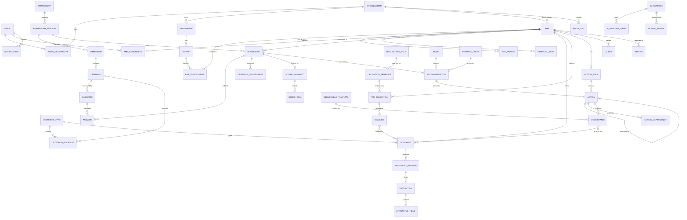

# Document 3 — Modèle de données

## 1. Conventions

- Clés primaires `UUID v7` (triables dans le temps, non devinables).
- Toute table métier porte `organization_id` (FK, NOT NULL, protégée par RLS), `created_at`, `created_by`, `updated_at` et `updated_by`. Les tables supportant la suppression logique portent `deleted_at`.
- Montants stockés en `NUMERIC(18,2)`, avec la devise dans `currency` (`XOF` par défaut).
- Énumérations métier stockées en `TEXT` + contrainte `CHECK` lorsqu'elles sont stables (statuts techniques), en **tables de référence** lorsqu'elles sont configurables par un tenant (secteurs, types de documents, catégories).
- Les objets **publiés et versionnés** (référentiel, règles, modèles de prompt) sont **immuables** : toute modification crée une nouvelle version.
- Les champs extensibles propres à un tenant sont stockés dans `attributes JSONB`, validés par un JSON Schema déclaré dans la configuration.

## 2. Vue d'ensemble (domaines)

## 3. Dictionnaire des entités

### 3.1 Socle : organisations, utilisateurs, accès

| Table | Champs clés | Contraintes / notes |
|---|---|---|
| `organization` | id, name, slug, type (`AGENCE_PUBLIQUE`, `BANQUE`, `INCUBATEUR`, `ONG`, `BAILLEUR`, `CABINET`, `ASSOCIATION`), country, branding JSONB, settings JSONB, ai_external_allowed BOOL, status | slug UNIQUE |
| `user` | id, email, phone, full_name, password_hash, mfa_secret (chiffré), locale, is_active, last_login_at | email UNIQUE (insensible à la casse) |
| `role` | id, organization_id (NULL = rôle système), code, label | UNIQUE(org, code) |
| `permission` | id, code (`document.verify`, `diagnostic.validate`, …) | catalogue système |
| `role_permission` | role_id, permission_id | PK composite |
| `user_membership` | user_id, organization_id, role_id, scope (`ORG`, `PROGRAMME`, `PORTEFEUILLE`, `PME`), scope_ref_id, valid_from, valid_to | un utilisateur peut avoir plusieurs appartenances |
| `programme` | id, org, name, description, start_date, end_date, funder, objectives JSONB | |
| `cohort` | id, programme_id, name, start_date | |

### 3.2 PME (niveau 1 : connaître)

| Table | Champs clés | Contraintes / notes |
|---|---|---|
| `pme` | id, org, legal_name, trade_name, legal_form_id, rccm_number, ncc (n° compte contribuable), cnps_employer_number, creation_date, sector_id, sub_sector_id, size_category (`MICRO`, `PETITE`, `MOYENNE`, `HORS_PME`, calculé), tax_regime_id, region_id, commune, address, phone, email, website, lifecycle_status, attributes JSONB | UNIQUE(org, rccm_number) si non NULL ; UNIQUE(org, ncc) si non NULL |
| `pme_person` | id, pme_id, full_name, role (`GERANT`, `DG`, `ASSOCIE`, `PCA`, …), share_pct, is_primary_contact, phone, email, gender (optionnel, statistiques genre), birth_year (optionnel) | somme des share_pct ≤ 100 (contrôle applicatif) |
| `pme_site` | id, pme_id, label, region_id, address, type | établissements secondaires |
| `financial_year` | id, pme_id, fiscal_year, period_start, period_end, is_audited, source (`DECLARATIF`, `EXTRACTION_IA`, `VALIDÉ`), revenue, net_income, total_assets, equity, debt_financial, cash, headcount, … | UNIQUE(pme_id, fiscal_year, source) ; la valeur « officielle » est la source de rang le plus élevé |
| `financial_line` | id, financial_year_id, statement (`BILAN_ACTIF`, `BILAN_PASSIF`, `RESULTAT`, `TFT`), ref_code (codes de rubriques SYSCOHADA), label, amount, source_extracted_field_id | permet la traçabilité ligne par ligne |
| `pme_enrollment` | id, pme_id, cohort_id, enrolled_at, exited_at, exit_reason | historique des programmes |
| `pme_assignment` | id, pme_id, user_id, role_in_pme (`CONSEILLER_PRINCIPAL`, `EXPERT`), from, to | un seul conseiller principal actif |
| Référentiels | `sector`, `legal_form`, `tax_regime`, `region`, `size_rule` | configurables par tenant ; `size_rule` contient les seuils de catégorisation sourcés |

### 3.3 Référentiel de diagnostic (versionné)

| Table | Champs clés | Contraintes / notes |
|---|---|---|
| `framework` | id, org, code, name | ex. `GUDE-360` |
| `framework_version` | id, framework_id, version (`1.0.0`), status (`DRAFT`, `PUBLISHED`, `RETIRED`), published_at, published_by, maturity_levels JSONB, global_weights JSONB | **immuable si PUBLISHED** (trigger) |
| `pillar` | id, framework_version_id, code, name, order | 3 piliers |
| `dimension` | id, framework_version_id, pillar_id, code (`D04_FIN`), name, description, weight, min_gate_score, order | somme des poids = 100 (validation à la publication) |
| `criterion` | id, dimension_id, code, name, lens (`CONFORMITE`, `ORGANISATION`, `PERFORMANCE`, `RISQUE`), weight, is_critical, rubric JSONB (description des niveaux 0 à 4), declarative_cap_level, applicability JSONB (règle JSON Logic : secteur, taille, régime…), evidence_policy (`NONE`, `RECOMMENDED`, `REQUIRED`) | |
| `question` | id, criterion_id, code, text, help_text, why_text, type (`SINGLE`, `MULTI`, `NUMBER`, `AMOUNT`, `DATE`, `TEXT`, `SCALE`, `FILE`), options JSONB (valeur → niveau), visibility JSONB (JSON Logic), order, target_audience (`PME`, `CONSEILLER`, `LES_DEUX`) | |
| `criterion_evidence` | criterion_id, document_type_id, min_freshness_days, level_if_verified | la preuve qui justifie un niveau |
| `metric_definition` | id, framework_version_id, code (`MARGE_NETTE`), formula (expression), inputs JSONB, unit, interpretation_bands JSONB, criterion_id (NULL possible) | formules financières configurables |

### 3.4 Diagnostic et scoring (niveaux 2 et 3)

| Table | Champs clés | Contraintes / notes |
|---|---|---|
| `diagnostic` | id, pme_id, framework_version_id, type (`INITIAL`, `SUIVI`, `REEVALUATION`, `CLOTURE`), status (`BROUILLON`, `EN_COLLECTE`, `ANALYSE_IA`, `EN_REVUE`, `VALIDÉ`, `ANNULÉ`), reference_date, started_at, submitted_at, validated_at, validated_by, lead_advisor_id | au plus un diagnostic non clos par PME |
| `answer` | id, diagnostic_id, question_id, value JSONB, answered_by, answered_at, source (`PME`, `CONSEILLER`, `IA_PREREMPLI`) | UNIQUE(diagnostic_id, question_id) ; historique conservé dans `answer_history` |
| `criterion_assessment` | id, diagnostic_id, criterion_id, level_declared, level_evidenced, level_ai_proposed, level_final, confidence, evidence_document_ids UUID[], ai_analysis_id, reviewer_id, review_comment, status (`AUTO`, `PROPOSÉ_IA`, `VALIDÉ`, `MODIFIÉ`, `NON_APPLICABLE`) | la justification est obligatoire si level_final ≠ level_ai_proposed |
| `score_snapshot` | id, pme_id, diagnostic_id, framework_version_id, kind (`BASELINE`, `FOLLOW_UP`, `CLOTURE`, `LIVE`), computed_at, engine_version, global_maturity, global_performance, compliance_index, risk_index, maturity_level, intervention_priority, confidence, gates_failed JSONB, is_frozen | les snapshots `BASELINE`, `FOLLOW_UP` et `CLOTURE` sont **immuables** |
| `score_item` | id, snapshot_id, scope (`DIMENSION`, `LENS`, `PILLAR`, `CRITERION`), ref_code, score, confidence, weight_used, inputs JSONB | contient le détail de l'explication |
| `metric_value` | id, pme_id, financial_year_id, metric_definition_id, value, inputs_used JSONB, source_refs JSONB, interpretation, computed_at | « formule → données → résultat → interprétation → source » |
| `score_change_explanation` | id, from_snapshot_id, to_snapshot_id, contributions JSONB (par dimension et critère), narrative (IA, validée) | explique les variations |

### 3.5 Documents et conformité

| Table | Champs clés | Contraintes / notes |
|---|---|---|
| `document_category` | id, org, code (`JURIDIQUE`, `FISCAL`, `SOCIAL`, `FINANCE`, `COMMERCIAL`, `ORGANISATION`, `DIGITAL`, `QUALITE`, `FINANCEMENT`), name, order | |
| `document_type` | id, org, category_id, code (`RCCM`, `DFE`, `ETATS_FIN_SYSCOHADA`, `ATTEST_CNPS`, …), name, description, validity_rule JSONB (durée, fin d'exercice…), period_kind (`AUCUNE`, `MOIS`, `TRIMESTRE`, `SEMESTRE`, `ANNEE`, `EXERCICE`), extraction_schema_id, allowed_mime JSONB, sensitive BOOL, retention_days | |
| `document` | id, pme_id, document_type_id (NULL tant que non classé), title, period_start, period_end, issued_at, expires_at, current_version_id, lifecycle axes (cf. § 4), status_display, uploaded_by, uploaded_via (`PORTAIL_PME`, `CONSEILLER`, `EMAIL` en V2) | |
| `document_version` | id, document_id, version_no, storage_key, sha256, size_bytes, mime_detected, page_count, av_status (`EN_ATTENTE`, `SAIN`, `INFECTÉ`, `ERREUR`), ocr_status, text_content (ou référence), created_at | UNIQUE(document_id, version_no) ; sha256 indexé (détection de doublons) |
| `extraction` | id, document_version_id, schema_code, schema_version, ai_analysis_id, overall_confidence, status (`PROPOSÉE`, `VALIDÉE`, `CORRIGÉE`, `REJETÉE`) | |
| `extracted_field` | id, extraction_id, field_key, value JSONB, confidence, page, bbox JSONB, validated_value JSONB, validated_by, validated_at | permet de revoir chaque valeur avec sa localisation dans le document |
| `document_check` | id, document_version_id, check_code (`ENTITE_CORRESPOND`, `PERIODE_ATTENDUE`, `DATE_VALIDITE`, `COHERENCE_CA`, …), result (`OK`, `ALERTE`, `ÉCHEC`, `NON_DÉTERMINÉ`), details JSONB | |
| `regulatory_rule` | id, org, code, title, description, authority (`DGI`, `CNPS`, `CEPICI`, `ARTCI`, …), source_title, source_url, source_reference (article, texte), applicability JSONB, verified_at, verified_by, status (`A_VERIFIER`, `VERIFIE`, `OBSOLETE`), review_due_at | **activation impossible si status ≠ VERIFIE** (règle RM-08) |
| `obligation_template` | id, org, code, document_type_id, regulatory_rule_id (NULL si obligation contractuelle GUDE), frequency (`PONCTUELLE`, `MENSUELLE`, `TRIMESTRIELLE`, `SEMESTRIELLE`, `ANNUELLE`), due_rule JSONB (par ex. « J+15 après la fin de période »), applicability JSONB, reminder_offsets INT[] (par ex. `{-30,-15,-7,0,+7}`), is_active | |
| `pme_obligation` | id, pme_id, obligation_template_id, start_date, end_date, frequency_override, status (`ACTIVE`, `SUSPENDUE`, `DISPENSÉE`), waiver_reason | |
| `deadline` | id, pme_obligation_id, period_label (`T4 2026`), period_start, period_end, due_date, status (`A_FOURNIR`, `EN_ATTENTE`, `RECU`, `EN_ANALYSE`, `CONFORME`, `CONFORME_SOUS_RESERVE`, `NON_CONFORME`, `EXPIRE`, `INCOHERENT`, `VERIF_HUMAINE_REQUISE`, `EN_RETARD`, `DISPENSE`), fulfilled_document_id, closed_at | UNIQUE(pme_obligation_id, period_start) (idempotence du générateur) |

### 3.6 Recommandations, plans et actions (niveau 4)

| Table | Champs clés | Contraintes / notes |
|---|---|---|
| `support_offer` | id, org, code, title, dimension_code, objective, description, typical_duration_days, deliverable_template_ids UUID[], required_document_type_ids UUID[], success_indicator, estimated_cost_min, estimated_cost_max, provider_type (`GUDE`, `PARTENAIRE`, `PME_SEULE`), sub_actions JSONB | catalogue d'accompagnement |
| `rule` | id, org, code, name, kind (`RECOMMANDATION`, `ALERTE`, `PRIORITE`, `WORKFLOW`), condition JSONB (JSON Logic), outcome JSONB (offer_id, priorité, message…), version, status (`DRAFT`, `ACTIVE`, `INACTIVE`), valid_from, tested_at | versionnée ; les tests sont exécutés sur les PME de démonstration avant activation |
| `recommendation` | id, pme_id, diagnostic_id, rule_id, rule_version, support_offer_id, source (`REGLE`, `IA`, `CONSEILLER`), problem, rationale, evidence_refs JSONB, impact, urgency, risk, effort, priority_score, priority_computed, priority_final, priority_override_reason, status (`PROPOSÉE`, `ACCEPTÉE`, `REJETÉE`, `CONVERTIE`) | |
| `action_plan` | id, pme_id, diagnostic_id, title, status (`BROUILLON`, `EN_VALIDATION`, `VALIDÉ`, `EN_COURS`, `CLOS`), horizon_start, validated_by_gude, validated_by_pme, validated_at, version | |
| `action` | id, human_ref (`ACT-2026-00123`), action_plan_id, parent_action_id, recommendation_id, dimension_code, problem, objective, title, description, owner_type (`PME`, `GUDE`, `PARTENAIRE`), owner_user_id, advisor_user_id, priority, phase (`J1_30`, `J31_60`, `J61_90`, `M6`, `M12`), start_date, due_date, status, estimated_cost, success_indicator, completed_at, workflow_instance_id | `human_ref` UNIQUE par organisation ; les statuts sont gérés par le workflow |
| `action_dependency` | action_id, depends_on_action_id, type (`FIN_DEBUT`) | pas de cycle (contrôle applicatif) |
| `deliverable_template` | id, org, code, title, category, file_storage_key, format, instructions, version | bibliothèque de livrables |
| `deliverable` | id, action_id, deliverable_template_id, title, required_document_type_id, document_id, status (`ATTENDU`, `DÉPOSÉ`, `À_VÉRIFIER`, `CONFORME`, `NON_CONFORME`) | |
| `comment` | id, target_type, target_id, author_id, body, visibility (`INTERNE_GUDE`, `PARTAGÉ_PME`) | commentaires internes non visibles par la PME |

### 3.7 Workflows

| Table | Champs clés | Notes |
|---|---|---|
| `workflow_definition` | id, org, code, target_type (`ACTION`, `DOCUMENT`, `DIAGNOSTIC`), version, states JSONB, transitions JSONB (from, to, permission, guard JSON Logic, effects) | configurable par tenant, versionné |
| `workflow_instance` | id, definition_id, definition_version, target_type, target_id, current_state | |
| `workflow_transition_log` | id, instance_id, from_state, to_state, actor_id, reason, at | |

### 3.8 IA

| Table | Champs clés | Notes |
|---|---|---|
| `ai_analysis` | id, org, pme_id, task_type (`CLASSIFICATION`, `EXTRACTION`, `ANOMALIES`, `PRE_DIAGNOSTIC`, `RECOMMANDATIONS`, `RAPPORT`, `ASK`), provider, model_id, prompt_template_code, prompt_version, input_hash, parameters JSONB, output JSONB, output_schema_version, confidence, status, tokens_in, tokens_out, cost, latency_ms, error, created_at | **traçabilité IA complète** |
| `ai_analysis_input` | analysis_id, input_type (`DOCUMENT_VERSION`, `ANSWER`, `METRIC`, `KB_CHUNK`), input_id | les données et documents analysés |
| `human_review` | id, analysis_id, target_type, target_id, decision (`VALIDÉ`, `MODIFIÉ`, `REJETÉ`), before JSONB, after JSONB, justification, reviewer_id, reviewed_at | historique « résultat IA → modification humaine » |
| `prompt_template` | id, code, version, system_prompt, user_template, output_schema JSONB, model_policy, status | versionné, testé par des jeux d'évaluation |
| `kb_source` | id, org (NULL = global), type (`REFERENTIEL`, `PROCEDURE`, `REGLEMENTAIRE`, `MODELE`, `DOCUMENT_PME`), title, pme_id NULL, access_scope | |
| `kb_chunk` | id, kb_source_id, org, pme_id NULL, content, embedding VECTOR(1024), metadata JSONB | index HNSW ; soumis à la RLS |
| `ai_conversation` / `ai_message` | conversation liée à un utilisateur et à un contexte (PME ou portefeuille) ; les messages portent les citations JSONB | |

### 3.9 Alertes, notifications, rapports, audit

| Table | Champs clés | Notes |
|---|---|---|
| `alert_rule` | id, org, code, kind, condition JSONB, severity, dedup_window_days, is_active | |
| `alert` | id, pme_id, rule_id, kind, severity (`INFO`, `MOYENNE`, `ÉLEVÉE`, `CRITIQUE`), title, details JSONB, target_type, target_id, status (`OUVERTE`, `PRISE_EN_COMPTE`, `RÉSOLUE`, `IGNORÉE`), resolved_by, resolution_note | dédoublonnage par (rule, target, période) |
| `notification_template` | id, org, event_code, channel, locale, subject, body | |
| `notification` | id, user_id, event_code, channel (`IN_APP`, `EMAIL`, `SMS`, `WHATSAPP`), payload JSONB, status (`EN_FILE`, `ENVOYÉE`, `ÉCHEC`, `LUE`), sent_at, read_at | |
| `notification_preference` | user_id, event_code, channel, enabled, digest (`IMMEDIAT`, `QUOTIDIEN`, `HEBDO`) | |
| `report` | id, org, type (`DIAGNOSTIC`, `SUIVI`, `CONFORMITE`, `TRIMESTRIEL_PME`, `ANNUEL_PME`, `PORTEFEUILLE`), scope JSONB, period, template_version, data_snapshot JSONB, storage_key, status, generated_by, generated_at | les données sont figées au moment de la génération |
| `audit_log` | id (BIGSERIAL), org, actor_id, actor_type (`USER`, `SYSTEM`, `AI`), action, entity_type, entity_id, before JSONB, after JSONB, ip, user_agent, request_id, at, prev_hash, hash | append-only, chaîné par hash |
| `domain_event_outbox` | id, org, event_type, payload, created_at, processed_at, attempts | |

## 4. Modèle de statut documentaire multi-axes

Un document n'a pas un statut unique, mais **cinq axes indépendants** qui lui sont propres, complétés par un **axe de conformité** porté par l'obligation ou le critère qu'il justifie. Le statut affiché (`status_display`) est **dérivé** de ces axes.

| Axe | Valeurs | Détermination |
|---|---|---|
| Réception | `NON_FOURNI`, `REÇU` | Upload |
| Intégrité | `EN_SCAN`, `SAIN`, `REJETÉ_SÉCURITÉ` | ClamAV + contrôle MIME |
| Validité | `VALIDE`, `EXPIRÉ`, `INDÉTERMINÉ` | Dates extraites + `validity_rule` |
| Actualité | `À_JOUR`, `PÉRIODE_ANTÉRIEURE`, `PÉRIODE_INCORRECTE` | Période extraite vs période attendue |
| Vérification | `NON_VÉRIFIÉ`, `ANALYSÉ_IA`, `VÉRIF_HUMAINE_REQUISE`, `VÉRIFIÉ_HUMAIN`, `REJETÉ` | Pipeline + revue |
| Conformité (sur l'obligation ou le critère) | `CONFORME`, `CONFORME_SOUS_RÉSERVE`, `NON_CONFORME`, `INCOHÉRENT`, `NON_ÉVALUÉ` | Décision humaine, éventuellement assistée par l'IA |

**Invariant** : `CONFORME` ⇒ Intégrité = `SAIN` ∧ Validité = `VALIDE` ∧ Actualité = `À_JOUR` ∧ Vérification = `VÉRIFIÉ_HUMAIN` (ou `ANALYSÉ_IA` avec confiance ≥ seuil **et** type de document autorisé en validation automatique par le tenant ; désactivé par défaut).

## 5. Contraintes et intégrité notables

1. Trigger interdisant UPDATE et DELETE sur `framework_version` publiée, sur les `score_snapshot` figés, sur `audit_log` et sur `human_review`.
2. Contrainte de publication : la somme des poids des dimensions = 100 ; la somme des poids des critères = 100 dans chaque dimension ; chaque critère `is_critical` possède au moins une preuve définie.
3. `deadline` est unique par (obligation, période) : le générateur est idempotent.
4. `action_dependency` sans cycle, vérifiée à l'insertion par un CTE récursif.
5. Les politiques RLS sont actives sur **toutes** les tables portant `organization_id` ; un test automatisé vérifie qu'aucune table métier n'en est dépourvue.
6. Index : `(organization_id, pme_id)` sur toutes les tables de faits ; `deadline(due_date, status)` ; `alert(status, severity)` ; `document_version(sha256)` ; index HNSW sur `kb_chunk.embedding`.

## 6. Données analytiques

Vues matérialisées (rafraîchies par événement, avec un plafond de fréquence) :
- `mv_pme_current_state` : dernier snapshot, conformité, actions (terminées, en cours, en retard), documents (conformes, manquants, expirés), alertes ouvertes.
- `mv_portfolio_weaknesses` : pour chaque critère ou dimension, part des PME sous le seuil de faiblesse, par secteur, région et taille.
- `mv_score_trajectories` : écarts baseline → dernier snapshot par PME et par cohorte.
- `mv_offer_effectiveness` : évolution moyenne des dimensions ciblées pour les PME ayant terminé une offre, comparée aux PME ne l'ayant pas suivie (indicateur **descriptif**, cf. RM-09).

## 7. Seed de démonstration (fictif)

| PME fictive | Secteur | Taille | Profil de démonstration |
|---|---|---|---|
| **Boutik Plus Distribution SARL** | Commerce | Petite | Bonne performance commerciale, maturité faible (CA élevé et gouvernance informelle) → illustre RM-02 |
| **Ivoire Métal Industrie SA** | Industrie | Moyenne | Finance solide, retards CNPS, incohérence de CA entre questionnaire et états financiers → alertes |
| **Bâti Lagune BTP SARL** | BTP | Moyenne | Forte dépendance à un client public, documents fiscaux expirés, risque élevé |
| **Conseil & Formation Akwaba SARLU** | Services | Micro | Structurée, peu de documents → score correct mais confiance faible |
| **Délices du Bandama SAS** | Agroalimentaire | Petite | Enjeux qualité et hygiène sectoriels, progression visible sur 3 snapshots |
| **NovaTech CI SAS** | Startup technologique | Micro | Digital et innovation forts, finance et formalisation faibles, besoin de financement |

Tous les noms, numéros (RCCM, NCC, CNPS) et personnes sont **inventés** et suivent un format visiblement fictif (préfixe `DEMO-`).
