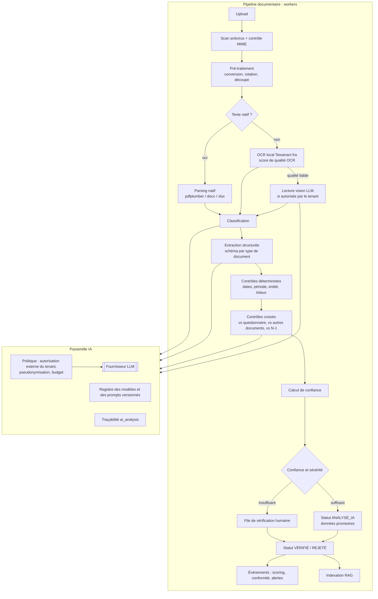

# Document 4 — Architecture IA : « AI PME Diagnostic Copilot »

## 1. Positionnement

L'IA n'est pas un chatbot ajouté au produit : c'est un **ensemble de fonctions spécialisées** intégrées aux workflows, chacune avec une entrée définie, une sortie structurée, un niveau de confiance et une validation humaine lorsque c'est nécessaire.

| Fonction | Déclencheur | Sortie | Validation humaine |
|---|---|---|---|
| A. Classification documentaire | Upload | Type, catégorie, entreprise, période | Si confiance < 0,85 ou désaccord avec le type attendu |
| B. Extraction structurée | Document classé | Champs typés + confiance + page/zone | Champs critiques (CA, résultat, dates, identifiants) < 0,90 |
| C. Contrôles et anomalies | Extraction terminée | Liste de contrôles OK / ALERTE / ÉCHEC | Toute anomalie de sévérité ≥ ÉLEVÉE |
| D. Analyse financière | États financiers validés | Ratios (calcul **déterministe**) + interprétation (LLM) | Interprétation relue avant publication dans un rapport |
| E. Analyse de conformité | Événements documentaires et échéances | Manquants, expirés, incohérents | Décision de conformité toujours humaine (par défaut) |
| F. Pré-diagnostic | Diagnostic soumis | Niveau proposé par critère + justification + sources | Revue par critère (valider / modifier / rejeter) |
| G. Recommandations | Diagnostic validé | Complément aux règles : reformulation, adaptation au contexte | Acceptation par le conseiller |
| H. Plan d'accompagnement | Recommandations acceptées | Séquencement 90 j / 6 m / 12 m, sous-actions, livrables | Validation du plan (GUDE + PME) |
| I. Rédaction des rapports | Demande de rapport | Sections narratives fondées sur des données figées | Relecture avant diffusion |
| J. Ask AI | Question d'un conseiller | Réponse citée (données et documents) | Aucune écriture autonome |

### Principe cardinal : l'IA ne calcule pas les chiffres

- **Les calculs** (ratios, scores, échéances, priorités) sont réalisés par du **code déterministe**, testé et reproductible.
- **Le LLM** lit, extrait, classe, compare, interprète et rédige. Il ne produit jamais un score ni un ratio par lui-même.
- Tout nombre affiché dans une réponse IA provient d'un outil (appel de fonction) ou d'une donnée citée.

## 2. Architecture logique



## 3. Passerelle IA (`ai.gateway`)

Point d'entrée **unique** de tout appel à un modèle. Aucun autre module n'appelle directement un fournisseur.

Responsabilités :
1. **Politique** : vérifier que le tenant autorise l'IA externe (`organization.ai_external_allowed`) et que le type de document n'est pas exclu (`document_type.sensitive`). Sinon, basculer vers le mode local (OCR + règles uniquement) ou vers un modèle auto-hébergé (V3).
2. **Minimisation et pseudonymisation** : remplacement des identifiants personnels (noms des dirigeants, téléphones, e-mails, n° d'identité) par des jetons avant l'envoi, puis ré-injection au retour. Les montants et les libellés comptables ne sont pas pseudonymisés : ils sont nécessaires à l'analyse et ne sont pas des données personnelles.
3. **Routage des modèles** par tâche (configurable) :

   | Tâche | Modèle par défaut | Raison |
   |---|---|---|
   | Classification, tri, contrôles simples | `claude-haiku-4-5` | Rapide, peu coûteux, volume élevé |
   | Extraction structurée, vision sur scans | `claude-sonnet-5` | Bon compromis précision / coût |
   | Pré-diagnostic, synthèses, rapports, Ask AI portefeuille | `claude-opus-5-5` | Raisonnement multi-sources et qualité rédactionnelle |

4. **Sorties structurées** : chaque tâche déclare un JSON Schema ; la sortie est validée, et un échec de validation entraîne une nouvelle tentative (1 au maximum), puis une vérification humaine.
5. **Traçabilité** : écriture systématique d'un `ai_analysis` (modèle, version du prompt, entrées, sortie, confiance, jetons, coût, latence).
6. **Résilience** : délais d'expiration, reprises exponentielles, disjoncteur ; en cas d'indisponibilité, le document reste « REÇU – analyse différée » sans bloquer la PME.
7. **Budget** : quotas de jetons par tenant et par mois, alerte à 80 %.
8. **Confidentialité fournisseur** : utilisation d'une offre API sans entraînement sur les données clients ; conditions de conservation à contractualiser (cf. décision D-03).

## 4. Extraction : schémas par type de document

Chaque `document_type` référence un **schéma d'extraction versionné**. Exemples :

### 4.1 États financiers SYSCOHADA (bilan + compte de résultat)

```json
{
  "entity": { "legal_name": "string", "ncc": "string|null", "rccm": "string|null" },
  "fiscal_year": { "start": "date", "end": "date" },
  "system": "NORMAL | SMT | INCONNU",
  "currency": "XOF",
  "income_statement": {
    "XB_chiffre_affaires": "number",
    "XA_marge_commerciale": "number|null",
    "XC_valeur_ajoutee": "number|null",
    "XD_ebe": "number|null",
    "XE_resultat_exploitation": "number|null",
    "XF_resultat_financier": "number|null",
    "XI_resultat_net": "number",
    "charges_personnel": "number|null",
    "dotations_amortissements": "number|null",
    "frais_financiers": "number|null"
  },
  "balance_sheet": {
    "actif_immobilise_net": "number", "stocks": "number|null",
    "creances_clients": "number|null", "autres_creances": "number|null",
    "tresorerie_actif": "number", "total_actif": "number",
    "capitaux_propres": "number", "dettes_financieres": "number",
    "fournisseurs": "number|null", "dettes_fiscales_sociales": "number|null",
    "autres_dettes": "number|null", "tresorerie_passif": "number", "total_passif": "number"
  },
  "prior_year_present": "boolean",
  "_meta": { "field_confidence": { "<field>": "0..1" }, "field_location": { "<field>": { "page": 1, "bbox": [0,0,0,0] } } }
}
```

> Les codes de rubriques (XA à XI, etc.) suivent le référentiel SYSCOHADA révisé ; leur correspondance exacte est **à confirmer** par l'expert-comptable du projet et est stockée en configuration (`metric_definition` / `financial_line.ref_code`).

### 4.2 Autres schémas (MVP)
- **RCCM** : n° RCCM, raison sociale, forme juridique, date d'immatriculation, siège, dirigeants.
- **DFE (Déclaration Fiscale d'Existence)** : NCC, régime, centre des impôts, date.
- **Attestation / justificatif CNPS** : n° employeur, période couverte, date de délivrance, date de validité, mention de régularité.
- **Attestation de régularité fiscale** : période, date de délivrance, date de validité, émetteur.
- **Statuts** : forme, capital, associés et répartition, objet social, organes, date.
- **Organigramme, procédures, contrats** : classification + résumé + quelques champs (dates, parties, durée) ; pas d'extraction exhaustive.

## 5. Contrôles et détection d'anomalies

Les contrôles sont d'abord **déterministes** ; le LLM n'intervient que pour les comparaisons sémantiques.

| Code | Contrôle | Type | Sévérité par défaut |
|---|---|---|---|
| `ENTITE_CORRESPOND` | Raison sociale, NCC ou RCCM du document = PME | Déterministe + comparaison approximative | CRITIQUE si différent |
| `PERIODE_ATTENDUE` | La période extraite couvre la période de l'échéance | Déterministe | ÉLEVÉE |
| `DATE_VALIDITE` | Document non expiré à la date de référence | Déterministe | ÉLEVÉE |
| `BILAN_EQUILIBRE` | Total actif = total passif (tolérance 0,5 %) | Déterministe | ÉLEVÉE (erreur d'extraction ou document douteux) |
| `COHERENCE_CA_DECLARATIF` | CA extrait vs CA déclaré dans le questionnaire (écart > 10 %) | Déterministe | MOYENNE → ÉLEVÉE si > 30 % |
| `COHERENCE_N_N1` | Variation anormale d'un poste (> 50 %) sans explication | Déterministe | MOYENNE |
| `COHERENCE_EFFECTIF_CNPS` | Effectif déclaré vs effectif figurant sur le justificatif CNPS | Déterministe | MOYENNE |
| `COHERENCE_REGIME_CA` | Régime fiscal déclaré compatible avec la tranche de CA (seuils en configuration, sourcés) | Déterministe | MOYENNE |
| `DOUBLON` | Même hash qu'un autre document | Déterministe | INFO |
| `QUALITE_LECTURE` | Qualité OCR insuffisante | Déterministe | Vérification humaine |
| `CONTENU_SUSPECT` | Incohérences typographiques ou de mise en page, dates impossibles | LLM (indicatif) | Vérification humaine ; **jamais** une accusation de fraude |

Chaque anomalie de sévérité ≥ MOYENNE crée une `alert` de type `incohérence détectée`, avec la mention : **« Incohérence détectée. Vérification requise. »**

## 6. Calcul de confiance

### 6.1 Confiance d'un champ extrait
`c_champ = min(c_modèle, c_lecture) × facteur_contrôles`
- `c_modèle` : confiance déclarée par le modèle, calibrée sur le jeu d'évaluation (la confiance brute d'un LLM n'est pas fiable telle quelle) ;
- `c_lecture` : 1,0 pour du texte natif, score OCR sinon ;
- `facteur_contrôles` : 1,0 si les contrôles liés passent, 0,6 en cas d'alerte, 0,3 en cas d'échec.

### 6.2 Confiance d'un document
Moyenne pondérée des champs critiques du schéma (les poids sont déclarés dans le schéma).

### 6.3 Confiance d'un score
Cf. Document 6, § 5 : elle dépend du **type de source** de chaque critère, de la **fraîcheur** et de la **couverture**.

## 7. Human-in-the-loop

```
Résultat IA ──► (confiance ≥ seuil ET aucune alerte ≥ ÉLEVÉE ET type autorisé en auto) ──► Provisoire accepté
      │                                                                                       │
      └──────► sinon ──► File « À vérifier » (priorisée) ──► Expert : Valider / Modifier / Rejeter
                                                                  │
                                                     human_review (before, after, justification)
```

- Les seuils sont paramétrables par tenant et par type de document.
- **Aucune** conformité n'est confirmée automatiquement dans la configuration par défaut.
- L'écran de revue affiche le document (page et zone surlignées), la valeur extraite, la confiance, les contrôles et les documents comparés.
- Les corrections humaines alimentent un **jeu d'évaluation** (après anonymisation) qui sert à mesurer la dérive et à améliorer les prompts. Aucun ré-entraînement de modèle n'est effectué sur des données clients.

## 8. RAG et base de connaissances

### 8.1 Sources indexées

| Source | Portée | Mise à jour |
|---|---|---|
| Référentiel de diagnostic (dimensions, critères, grilles) | Tenant | À chaque publication |
| Catalogue d'offres et bibliothèque de livrables | Tenant | À chaque modification |
| Procédures internes GUDE-PME | Tenant | Manuelle |
| Registre réglementaire (**uniquement les règles au statut VÉRIFIÉ**) | Tenant / global | À chaque vérification |
| Documents de la PME (texte extrait) | **PME** | Après vérification |
| Historique de la PME (diagnostics, snapshots, actions, commentaires partagés) | **PME** | Par événement |

### 8.2 Principes
- **Filtrage de sécurité avant la recherche vectorielle** : `organization_id` (RLS) + `pme_id` + périmètre de l'utilisateur. Un conseiller ne récupère jamais de fragments d'une PME hors de son périmètre.
- Recherche **hybride** (vectorielle + plein texte PostgreSQL) avec re-classement.
- Découpage selon la structure du document (sections, tableaux conservés entiers).
- Chaque fragment porte ses métadonnées de citation (document, version, page, date).

### 8.3 Données structurées : outils plutôt que RAG
Pour les chiffres, les scores, les actions et les échéances, le Copilot utilise des **outils** (appels de fonctions) qui interrogent l'API interne avec les droits de l'utilisateur, **et non** la recherche vectorielle :

| Outil | Rôle |
|---|---|
| `get_pme_profile(pme_id)` | Fiche synthétique |
| `get_scores(pme_id, snapshot?)` | Scores, niveaux, confiance, explication |
| `compare_snapshots(pme_id, a, b)` | Écarts et contributions |
| `get_financial_metrics(pme_id, years)` | Ratios avec formule et source |
| `list_documents(pme_id, status?)` | Documents et statuts |
| `list_deadlines(pme_id, window?)` | Échéances |
| `list_actions(pme_id, status?)` | Actions |
| `list_alerts(scope, severity?)` | Alertes |
| `portfolio_query(metric, group_by, filters)` | Agrégats de portefeuille (requêtes prédéfinies, **pas de SQL libre**) |
| `search_knowledge(query, scope)` | RAG |
| `draft_report(type, scope, period)` | Lance la génération de rapport (brouillon) |

## 9. Ask AI (Copilot du conseiller)

- Contexte : une PME ou le portefeuille de l'utilisateur.
- Boucle agentique limitée (8 appels d'outils au maximum), en **lecture seule**. Les seules actions possibles sont des **brouillons** (rapport, liste d'actions proposées) que l'utilisateur valide ensuite dans l'interface.
- Format de réponse imposé : réponse, puis **« Sur quoi repose cette réponse »** (liste des sources : données avec date, documents avec page), puis **niveau de confiance**, puis **limites** (données manquantes).
- Si les données sont insuffisantes, l'assistant le dit et liste ce qui manque. Il ne complète jamais par des suppositions.
- Réponses en streaming (SSE). Conversations conservées et auditables.

Exemples de questions prises en charge : cf. cahier des charges § 42 (problèmes principaux, raisons d'un score faible, documents manquants, priorités, évolution depuis le dernier diagnostic, PME nécessitant une intervention, problèmes fréquents, préparation du rapport trimestriel, comparaison avec le diagnostic initial).

## 10. « Pourquoi cette recommandation ? »

Chaque recommandation porte une **chaîne d'explication** stockée :

```
Recommandation : « Mise en place d'un reporting financier mensuel »
 ├─ Règle : R-FIN-003 v2 : Finance < 50 ET critère FIN-REPORTING ≤ 1
 ├─ Données : Score Finance = 41/100 (confiance 78 %) ; FIN-REPORTING niveau 1 (« pas de suivi mensuel »)
 ├─ Sources : Questionnaire Q-FIN-07 (réponse du 12/03/2026) ; états financiers 2025 (p. 2 à 4)
 ├─ Complément IA : « Le BFR représente 96 jours de CA ; sans suivi mensuel, les tensions de trésorerie ne sont pas anticipées. »
 └─ Validation : acceptée par K. B. (conseiller) le 14/03/2026
```

## 11. Traçabilité IA (exigence § 28)

Chaque `ai_analysis` enregistre : le modèle (identifiant exact), le fournisseur, la version du prompt, la date, les entrées (documents et versions, réponses, fragments RAG), les données extraites, le résultat, la confiance, les recommandations produites, les jetons et le coût, ainsi que la ou les `human_review` associées. Ces éléments sont consultables depuis chaque résultat via un bouton **« Voir l'analyse IA »**.

## 12. Évaluation et qualité de l'IA

- **Jeu d'évaluation** constitué de documents fictifs et de documents réels anonymisés avec accord, annotés par un expert.
- Métriques : exactitude par champ, exactitude de classification, calibration de la confiance (ECE), taux de faux positifs sur les anomalies.
- **Critères d'activation en production** : ≥ 95 % d'exactitude sur les champs financiers clés, ≥ 97 % de classification correcte sur les 10 types de documents principaux.
- Toute nouvelle version de prompt ou de modèle est rejouée sur le jeu d'évaluation avant activation (comparaison A/B hors ligne).

## 13. Risques IA et mesures

| Risque | Mesure |
|---|---|
| Hallucination de chiffres | Calculs déterministes, citations obligatoires, validation par schéma |
| Sur-confiance | Calibration, seuils conservateurs, human-in-the-loop par défaut |
| Fuite de données | Passerelle unique, pseudonymisation, RLS sur le RAG, paramètre de tenant, fournisseur sans entraînement |
| Injection de prompt via un document | Le contenu des documents est traité comme une **donnée** (balisage, instruction système explicite), aucun outil d'écriture n'est accessible, les sorties sont validées par schéma |
| Biais sectoriels | Référentiel adapté au secteur, revue humaine, suivi des écarts IA/humain par secteur |
| Dépendance à un fournisseur | Abstraction de la passerelle, prompts et schémas versionnés, mode dégradé local |
| Coût | Routage des modèles, cache des analyses par hash de document, quotas |
