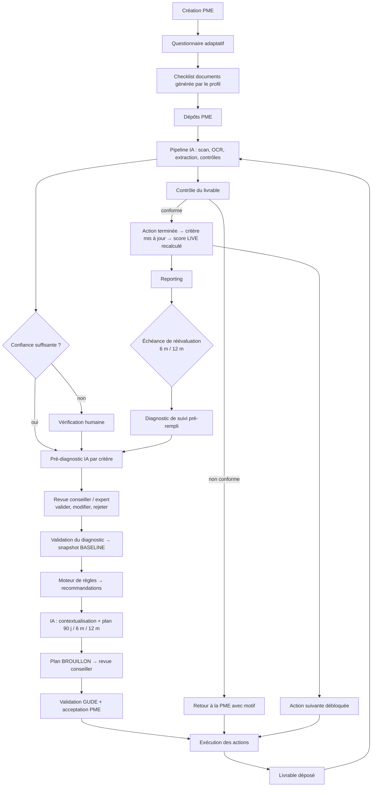

# Document 7 — Workflow d'accompagnement

## 1. Cycle global



## 2. Machines à états

Les états et transitions sont **définis en base** (`workflow_definition`) et modifiables par un administrateur. Les versions par défaut sont les suivantes.

### 2.1 Diagnostic

| De | Vers | Qui | Garde |
|---|---|---|---|
| BROUILLON | EN_COLLECTE | Conseiller | PME et profil minimal renseignés |
| EN_COLLECTE | ANALYSE_IA | PME ou conseiller (« Soumettre ») | ≥ 70 % des questions obligatoires renseignées |
| ANALYSE_IA | EN_REVUE | Système | Pré-diagnostic produit (ou échec IA → passage direct en revue) |
| EN_REVUE | VALIDÉ | Conseiller (+ expert si configuré pour D04) | Tous les critères revus **ou** acceptés en lot avec confirmation ; les modifications sont justifiées |
| EN_REVUE | EN_COLLECTE | Conseiller | Motif (informations manquantes) |
| * | ANNULÉ | Responsable programme | Motif |

### 2.2 Action (statuts demandés dans le cahier des charges)

```
NON_COMMENCÉ ──► EN_COURS ──► DOCUMENT_DEMANDÉ ──► DOCUMENT_REÇU ──► À_VÉRIFIER ──► CONFORME ──► TERMINÉ
      │              │  ▲               │                                   │
      │              │  └───────────────┴──────── NON_CONFORME ◄────────────┘
      │              ├──► EN_ATTENTE_PME ◄──► EN_ATTENTE_GUDE
      └──────────────┴──► ABANDONNÉ (motif obligatoire, validation conseiller)
```

Un état technique **BLOQUÉ** précède NON_COMMENCÉ pour les actions dont une dépendance n'est pas terminée. Il est affiché à la PME sous la forme « Disponible après : <action> ».

| Transition | Déclencheur | Effets automatiques |
|---|---|---|
| BLOQUÉ → NON_COMMENCÉ | Système : toutes les dépendances sont terminées | Notification à la PME |
| NON_COMMENCÉ → EN_COURS | Responsable de l'action | Date de début renseignée |
| EN_COURS → DOCUMENT_DEMANDÉ | Action exigeant un livrable | Notification à la PME avec le modèle joint |
| DOCUMENT_DEMANDÉ → DOCUMENT_REÇU | Upload lié à l'action | Lancement du pipeline documentaire |
| DOCUMENT_REÇU → À_VÉRIFIER | Fin de l'analyse IA | Entrée dans la file « Ma journée » du conseiller |
| À_VÉRIFIER → CONFORME | Conseiller / expert | Mise à jour du critère lié (preuve vérifiée), recalcul du score LIVE |
| À_VÉRIFIER → NON_CONFORME | Conseiller / expert | Motif obligatoire, **rédigé en langage simple pour la PME**, retour à la PME |
| CONFORME → TERMINÉ | Automatique si tous les livrables sont conformes, sinon manuel | Déblocage des actions dépendantes, notification |
| * → EN_ATTENTE_PME / EN_ATTENTE_GUDE | Manuel | Le compteur de retard est imputé à la partie en attente (utile pour l'analyse) |
| Tout état → en retard (drapeau, pas un état) | Planificateur : `due_date` dépassée et état non terminal | Alerte « action en retard », relance |

### 2.3 Plan d'accompagnement

`BROUILLON → EN_VALIDATION → VALIDÉ → EN_COURS → CLOS`, avec la possibilité de créer une **nouvelle version** du plan (l'historique est conservé) lors d'une réévaluation ou d'un changement majeur.

### 2.4 Document

Cf. Document 3, § 4 (modèle multi-axes) et Document 8, § 5 (cycle d'une échéance).

## 3. Moteur de recommandations (règles sans code)

### 3.1 Structure d'une règle

```json
{
  "code": "R-FIN-003",
  "name": "Reporting financier absent",
  "kind": "RECOMMANDATION",
  "version": 2,
  "condition": {
    "and": [
      { "<": [ { "var": "dimension.D04_FIN.score" }, 50 ] },
      { "<=": [ { "var": "criterion.FIN-04.level" }, 1 ] }
    ]
  },
  "outcome": {
    "support_offer": "OFF-FIN-REPORTING",
    "impact": 4, "urgency": 3, "risk": 3,
    "rationale_template": "Le score Finance est de {{dimension.D04_FIN.score}}/100 et aucun reporting périodique n'existe (FIN-04 niveau {{criterion.FIN-04.level}})."
  }
}
```

### 3.2 Variables disponibles dans les conditions
- `pme.*` : profil (secteur, taille, effectif, régime, âge, région) ;
- `dimension.<code>.score | confidence | coverage` ;
- `criterion.<code>.level | evidenced | applicable` ;
- `metric.<code>.value | band` (dernier exercice) ;
- `lens.<C|O|P|R>.score`, `global.score`, `imo`, `ipe`, `risk_index`, `compliance_rate` ;
- `trend.<indicateur>.delta_6m` ;
- `alerts.open.<kind>.count` ;
- `deadlines.overdue.count`.

### 3.3 Éditeur de règles (Settings)
- Constructeur visuel (« SI … ET … ALORS proposer … ») générant du JSON Logic ; édition JSON brute réservée à l'ADMIN_ORG.
- **Bouton « Tester »** : exécute la règle sur la seed et sur le portefeuille (en lecture seule), puis affiche le nombre et la liste des PME concernées **avant** activation.
- Versionnement : une règle active n'est jamais modifiée ; on en crée une nouvelle version. Les recommandations gardent la trace de `rule_id` et de `rule_version`.
- Détection des conflits : deux règles actives proposant la même offre pour la même PME sont fusionnées (priorité maximale retenue, les deux justifications sont conservées).

### 3.4 Catalogue d'offres d'accompagnement (exemples de seed)

| Code | Offre | Dimension | Durée type | Livrables (modèles) | Documents requis | Indicateur de réussite |
|---|---|---|---|---|---|---|
| OFF-JUR-DOSSIER | Complétude du dossier juridique | D01 | 30 j | Checklist juridique | RCCM, statuts, DFE, PV | FOR-01 à FOR-03 au niveau ≥ 3 |
| OFF-FIS-REGUL | Régularisation et calendrier fiscal | D02 | 60 j | Calendrier fiscal | Déclarations, attestation de régularité | FIS-02 et FIS-03 ≥ 3 |
| OFF-SOC-CNPS | Mise à jour CNPS et dossiers du personnel | D03 | 60 j | Registre du personnel, modèle de contrat | Justificatifs CNPS | SOC-03 ≥ 3 sur 2 périodes consécutives |
| OFF-FIN-TRESO | Tableau de trésorerie | D04 | 30 j | Tableau de trésorerie (xlsx) | Tableau des 3 derniers mois | FIN-03 ≥ 3 |
| OFF-FIN-REPORTING | Reporting financier mensuel | D04 | 60 j | Tableau de bord financier | 2 reportings mensuels | FIN-04 ≥ 3 |
| OFF-STR-BP | Élaboration du business plan | D05 | 90 j | Business plan, prévisionnel | BP validé | STR-04 ≥ 3 |
| OFF-COM-CRM | Structuration commerciale et CRM | D06 | 60 j | Tableau de suivi commercial | Pipeline à jour | COM-01, COM-02 ≥ 3 |
| OFF-OPE-ACHATS | Procédure d'achats | D07 | 30 j | Procédure achats | Procédure signée | OPE-02 ≥ 3 |
| OFF-RH-BASE | Socle RH : organigramme, fiches de poste, manuel RH | D08 | 60 j | Organigramme, fiche de poste, manuel RH | Documents validés | RHO-01, RHO-02 ≥ 3 |
| OFF-DIG-SECU | Sauvegardes et cybersécurité de base | D09 | 30 j | Politique de sauvegarde, politique informatique | Politique + preuve de test de restauration | DIG-04, DIG-05 ≥ 3 |
| OFF-RIS-CI | Contrôle interne et caisse | D10 | 45 j | Procédure de caisse, registre des risques | Procédure + 1 mois de rapprochements | RIS-02, RIS-03 ≥ 3 |
| OFF-FIO-DOSSIER | Préparation d'un dossier de financement | D11 | 60 j | Plan de financement | Dossier complet | FIO-03 ≥ 3 |

## 4. Du diagnostic au plan : algorithme

1. **Collecte** des recommandations : règles actives évaluées sur le snapshot validé, plus les propositions IA (marquées `source = IA`, jamais automatiquement acceptées).
2. **Dédoublonnage** par offre.
3. **Notation** Impact / Urgence / Risque / Effort (Document 6, § 9) et calcul du PS.
4. **Revue par le conseiller** : accepter, rejeter (motif) ou ajuster la priorité (motif).
5. **Génération du plan** :
   - conversion de chaque recommandation acceptée en **action** (avec les sous-actions de l'offre) ;
   - création des **livrables attendus** liés aux modèles et aux types de documents ;
   - calcul des **dépendances** (par ex. le business plan dépend des états financiers) ;
   - affectation aux **horizons** (J1–30, J31–60, J61–90, 6 m, 12 m) selon les règles et la capacité ;
   - rédaction par l'IA du **« pourquoi » en langage PME** pour chaque action.
6. **Validation** : conseiller, puis acceptation par le dirigeant de la PME (horodatée) ; le plan passe à VALIDÉ.

### 4.1 Fiche action (tous les champs demandés au § 13)

| Champ | Exemple |
|---|---|
| ID | ACT-2026-00142 |
| Dimension | D08 — RH & organisation |
| Problème | Absence de procédures RH et de fiches de poste |
| Objectif | Clarifier les rôles et sécuriser la gestion du personnel |
| Action | Mettre en place un manuel RH |
| Sous-actions | 1. Organigramme · 2. Fiches de poste (5 postes clés) · 3. Rédaction du manuel · 4. Validation par le dirigeant · 5. Diffusion au personnel |
| Responsable | PME (Aya K.) |
| Accompagnateur | Konan B. (GUDE-PME) |
| Priorité | Élevée (PS 63) |
| Échéance | 30 jours après le démarrage |
| Statut | EN_COURS |
| Livrable attendu | Manuel RH validé et signé |
| Document justificatif | MANUEL_RH (PDF signé) + ORGANIGRAMME |
| Coût estimatif | 0 (accompagnement GUDE) à 500 000 FCFA (consultant externe) |
| Indicateur de réussite | RHO-01 et RHO-02 au niveau ≥ 3 |
| Dépendances | ACT-2026-00139 (organigramme) |

## 5. Moteur de workflow : déclencheurs et enchaînements

Les enchaînements (« une action peut déclencher une autre action ») sont des règles de type `WORKFLOW` :

| Événement déclencheur | Condition | Effet |
|---|---|---|
| `task.transitioned` → TERMINÉ | L'action débloque des dépendantes | Les actions dépendantes passent de BLOQUÉ à NON_COMMENCÉ, et la PME est notifiée |
| `document.verified` | Type = ETATS_FIN_SYSCOHADA | Recalcul des indicateurs financiers, réévaluation des critères P de D04, déclenchement des règles FIN |
| `score.changed` | La dimension franchit un seuil (par ex. D04 ≥ 60) | Déblocage des offres de croissance (D11) |
| `deadline.overdue` | Obligation critique en retard de plus de 15 jours | Création d'une action « Régularisation » + alerte + notification au conseiller |
| `alert.raised` | Incohérence de sévérité ÉLEVÉE | Tâche de vérification assignée à l'expert de la dimension |
| Planificateur | Snapshot BASELINE ≥ 6 mois | Création d'un diagnostic de suivi pré-rempli |

Garanties : gestionnaires **idempotents** ; profondeur maximale de cascade (5) pour éviter les boucles ; chaque effet automatique est journalisé (`actor_type = SYSTEM`, avec la règle d'origine).

## 6. Réévaluation périodique

| Type | Fréquence par défaut | Contenu |
|---|---|---|
| Mise à jour continue (score LIVE) | À chaque preuve vérifiée | Critères impactés seulement ; pas de snapshot figé |
| Diagnostic de suivi | 6 mois | Questionnaire pré-rempli (la PME confirme ou modifie), revue des critères modifiés → snapshot `FOLLOW_UP` |
| Réévaluation complète | 12 mois | Diagnostic complet, nouveau plan → snapshot `FOLLOW_UP` |
| Diagnostic de clôture | Sortie du programme | Snapshot `CLOTURE`, rapport de fin d'accompagnement |

## 7. Bibliothèque de livrables (seed initiale)

| Catégorie | Modèles |
|---|---|
| Organisation | Organigramme, fiche de poste, manuel de procédures, cartographie des processus |
| Finance | Tableau de trésorerie, budget annuel, tableau de bord financier, plan de financement, prévisionnel 3 ans |
| Stratégie | Business model canvas, business plan, plan stratégique, feuille de route |
| RH | Manuel RH, procédure de recrutement, grille d'entretien annuel, plan de formation, registre du personnel |
| Commercial | Procédure commerciale, tableau de suivi du pipeline, plan marketing, grille tarifaire, registre des réclamations |
| Opérations | Procédure achats, fiche d'inventaire, plan de maintenance, fiche de coût de revient |
| Risques | Registre des risques, procédure de caisse, plan de continuité d'activité |
| Digital | Politique informatique, politique de sauvegarde, inventaire SI |

Chaque modèle comprend : le fichier (docx ou xlsx), des **instructions de remplissage en langage simple**, un **exemple rempli fictif** et les **critères de vérification** qui servent à l'IA et au conseiller lors du contrôle du livrable.

## 8. Moteur d'alertes

### 8.1 Principes
- Une alerte est produite par une **règle de type `ALERTE`** (`alert_rule`, JSON Logic, mêmes variables qu'au § 3.2) évaluée sur événement (`document.analyzed`, `score.changed`, `deadline.overdue`, `task.transitioned`…) et par le planificateur quotidien.
- **Dédoublonnage** par (règle, cible, période) sur `dedup_window_days` : une même situation ne produit qu'une alerte ouverte.
- Cycle de vie : `OUVERTE → PRISE_EN_COMPTE → RÉSOLUE | IGNORÉE` (motif obligatoire pour IGNORÉE). **Résolution automatique** lorsque la condition disparaît (document déposé et vérifié, action terminée…), journalisée avec `actor_type = SYSTEM`.
- Effets : une alerte CRITIQUE ouverte place la PME en priorité **P1** (Document 6, § 6) et bloque le niveau N4 (porte de maturité).
- Seuils, sévérités et destinataires sont des **valeurs par défaut** modifiables par tenant.

### 8.2 Catalogue par défaut (types demandés au § 17 du cahier des charges)

| Code | Type | Condition par défaut | Sévérité | Destinataires | Version |
|---|---|---|---|---|---|
| ALR-DOC-EXPIRE | Document expiré | Axe Validité = `EXPIRÉ` sur un document exigé ; préavis INFO à J-30 de `expires_at` | ÉLEVÉE | PME, conseiller | MVP |
| ALR-DOC-MANQUANT | Document manquant | Document `REQUIRED` applicable non fourni 30 jours après sa demande | MOYENNE | PME, conseiller | MVP |
| ALR-ECHEANCE-PROCHE | Échéance proche | `deadline.due_soon` (J-7) sans dépôt commencé | INFO | PME | MVP |
| ALR-OBLIGATION-DEPASSEE | Obligation dépassée | `deadline.overdue` à J+15 ; CRITIQUE à J+30 si l'obligation est critique | ÉLEVÉE → CRITIQUE | PME, conseiller, responsable programme (escalade) | MVP |
| ALR-INCOHERENCE | Incohérence détectée | Contrôle croisé (`COHERENCE_*`, `BILAN_EQUILIBRE`) en ALERTE ou ÉCHEC de sévérité ≥ MOYENNE (Document 4, § 5). Libellé : **« Incohérence détectée. Vérification requise. »** | selon le contrôle | Conseiller, expert de la dimension | MVP |
| ALR-ANOMALIE-DOC | Anomalie documentaire | `ENTITE_CORRESPOND` en échec, `QUALITE_LECTURE` insuffisante, `CONTENU_SUSPECT`, fichier `REJETÉ_SÉCURITÉ` | ÉLEVÉE (CRITIQUE si infecté ou entité différente) | Conseiller | MVP |
| ALR-SCORE-BAISSE | Score en baisse | Score global LIVE en baisse de ≥ 5 points par rapport au dernier snapshot figé, **ou** une dimension en baisse de ≥ 10 points | MOYENNE (ÉLEVÉE si pilier A) | Conseiller | MVP |
| ALR-RISQUE-ELEVE | Risque élevé | Indice d'exposition au risque ≥ 70 | ÉLEVÉE | Conseiller, responsable programme | MVP |
| ALR-ACTION-RETARD | Action en retard | `due_date` dépassée et état non terminal ; ÉLEVÉE si l'action est critique ou en retard de plus de 15 jours | MOYENNE → ÉLEVÉE | Responsable de l'action, conseiller | MVP |
| ALR-STAGNATION | Absence de progression | Moins de +2 points de score global en 6 mois d'accompagnement actif (même seuil que la priorité P2) | MOYENNE | Conseiller, responsable programme | MVP |
| ALR-CA-BAISSE | Baisse importante du CA | `CA_CROISSANCE` ≤ −20 % entre deux exercices dont au moins le plus récent est analysé ou vérifié | ÉLEVÉE | Conseiller | MVP |
| ALR-DEGRADATION-FIN | Dégradation financière | Au moins 2 indicateurs parmi `AUTONOMIE`, `LIQ_GEN`, `CAP_REMB`, `TN` qui descendent d'une bande par rapport à N-1, **ou** capitaux propres négatifs, **ou** trésorerie nette négative et en baisse sur les situations intermédiaires | ÉLEVÉE (CRITIQUE si capitaux propres négatifs) | Conseiller, expert finance | V2 (analyse multi-exercices, Document 10) |

> Les alertes « baisse du CA » et « dégradation financière » décrivent une **évolution des données**. Leur libellé n'impute aucune cause, et elles ne sont jamais présentées à la PME comme un jugement : la PME voit l'action proposée, pas l'alerte interne.

### 8.3 Notifications associées (§ 18 du cahier des charges)

| Paramètre | Niveau de configuration | Valeur par défaut |
|---|---|---|
| Canaux | Tenant (canaux activés) + utilisateur (préférences par événement) | In-app + e-mail (MVP) ; SMS / WhatsApp en V2 |
| Modèles de messages | Tenant (`notification_template` par événement, canal et langue) | Modèles de la seed, en langage simple pour la PME |
| Fréquence | Utilisateur : immédiat, résumé quotidien ou hebdomadaire | Immédiat pour CRITIQUE et ÉLEVÉE ; résumé quotidien pour le reste |
| Décalages de relance | Obligation et tenant | `-30, -15, -7, 0, +7, +15, +30` jours (Document 8, § 5) |
| Messages non désactivables | Système | Relances de retard sur obligation critique, alertes CRITIQUES, sécurité du compte |

La notification est un **effet** de l'alerte ou de l'événement, pas une entité métier : l'historique de référence reste l'alerte et le journal d'audit.
